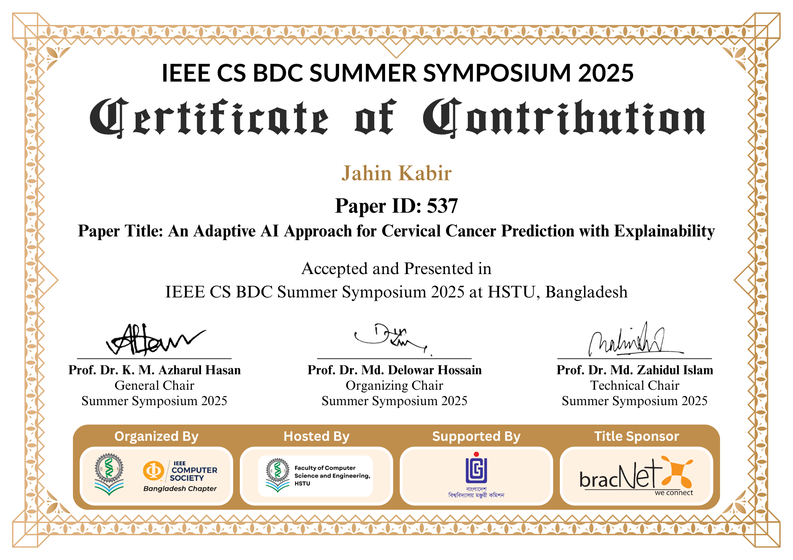

# Hi 👋 I'm Jahin Kabir

💻 Software Developer | AI & Machine Learning Enthusiast
🎓 B.Sc. in Computer Science & Engineering – HSTU
📍 Bangladesh

---

## 🚀 Professional Summary

Passionate software developer with experience in backend development, web technologies, and artificial intelligence. Skilled in building dynamic applications using PHP and modern web frameworks. Interested in solving real-world problems using machine learning, computer vision, and data-driven systems.

---

## 🧠 Technical Skills

### Programming Languages

### Web Development

### AI & Machine Learning

Machine Learning • Computer Vision • Time-Series Modeling • Data Preprocessing • Feature Extraction • Model Evaluation • Data Visualization • Prompt Engineering • Conversational AI Design

### Databases

MySQL • SQL Queries • Database Design • Data Management

### Tools & Platforms

Git • GitHub • XAMPP • VS Code • LaTeX

### Cloud & Distributed Computing

Cloud Computing Concepts • Virtualization • MapReduce • Distributed File Systems • Parallel Computing (MPI)

---

## 📂 Projects

### Alumni Management System

**Tech:** HTML, CSS, PHP, MySQL

* Developed a web-based system to manage alumni records and communication
* Implemented authentication and form validation
* Designed relational database schema and optimized SQL queries

### ASL Fingerspelling Interpretation

**Tech:** Machine Learning, Image Processing

* Developed an AI system to translate ASL fingerspelling
* Implemented supervised ML classification for hand gesture recognition

### PRISM_NET – Lightweight CNN Model

**Tech:** Python, Machine Learning

* CNN model for plant disease detection
* Includes smart caching system and automatic class balancing
* Optimized for faster image processing with GPU support

### Nirapod Bangladesh Shongstha Website

**Tech:** React, Next.js

* Developed and deployed a complete organizational website

### Human Behavior Prediction Model

**Tech:** Python, Machine Learning

* Built time-series ML model predicting activity level, screen time, and mood trends
* Implemented visualization and comparative model evaluation

### Computer Lab LAN Architecture

* Designed structured ring topology network for 20 nodes
* Developed IP addressing scheme and Ethernet cabling layout

---
## 📜 Certifications

IEEE CS BDC SUMMER SYMPOSIUM
- 

  
## 📊 GitHub Stats

---

## 🌐 Connect With Me

📧 Email: [jahinkabir2024@gmail.com](mailto:jahinkabir2024@gmail.com)
💼 LinkedIn: https://linkedin.com/in/jahinkabir
💻 GitHub: https://github.com/entityInBlack

---

⭐ *Always learning, building, and improving.*
